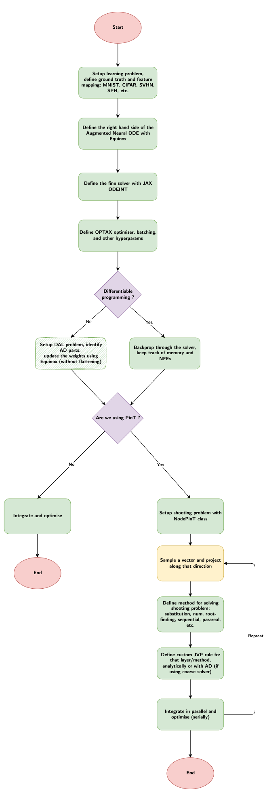

# NodePinT

Parallel-in-time integration of Neural ODEs with reduced basis approximation.

## Features
- Neural ordinary differential equations for a wide family of problems
- Time-parallelisation (or layer parallelisation if compared to ResNets)
- Reduced order modelling as a by-product of the the training process

## Benchmarks
| Dataset       | Training Time | Training Acc | Test Acc | Peak Memory | Network Size | Language   | Hyperparams/Script |
|---------------|---------------|--------------|---------|------------|--------------|------------|-------------|
| MNIST         | 272.57 seconds       | 98.172%          | 97.117%     | 10.657 GB       | -     | Julia     | [Link](./examples/mnist/00_discriminating_mnist.py) |
|               |        |           |      |        |      | Jax     | [Link](/path/to/hyperparameters2.json) |
|               |      |           |      |        |      | NodePinT     | [hyperparameters3.json](/path/to/hyperparameters3.json) |
| SPH   | 3.5 hours     | 92%          | 88%     | 6 GB       | 4 layers     | NodePinT | [hyperparameters4.json](/path/to/hyperparameters4.json) |

## Getting started
`pip install nodepint`

## Flowcharts

  
Click to expand/collapse

<!-- ## Put the two image below in a table -->

| NodePinT General Logic | Encode-Process-Decode Logic |
|---------------|---------------|
|  | 

## ToDos

  
Click to expand/collapse

- [ ] Massive parallelisation by combining time with data
- [ ] Stochastic ODEs and diffusion models time parallelisation
- [ ] Parallelism accross the projection absis. Since the PinT problem is projected on a lower dimensional space, this allows for further parallelism (2nd level):
    - If we always project on a randomly sampled 1D space, we can also solve the ODEs in parallel and average the NN weights without having to re(jit)compile
    - If we project on an increasingly bigger randomly sampled spaces, we can still do it, but we need to re(jit)compile the PinT processes
    - If we construct our space in a deterministic way (via sensitivity analysis wrt the latest added vector), then we can't parallelise since it will be sequential.
- [ ] For optimal control (OC) while training a neural ODE, we propose several combinations:
    - DP for training, and DAL for OC
    - DP both for training and OC (a bit like PINN)
    - Same as above, but DAL for training

## Dependencies
- JAX
- Equinox
- Datasets (the "jax" extra)
- Julia bindings to Python for SPH (all papers should benchmark NODEs on physical data upon us realeasing the SPHPC dataset)
